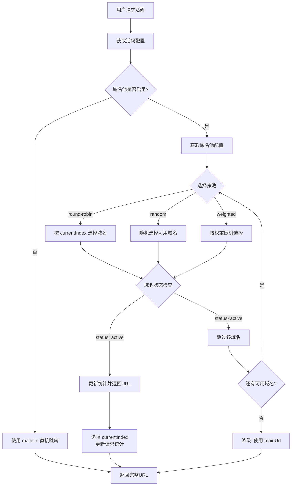
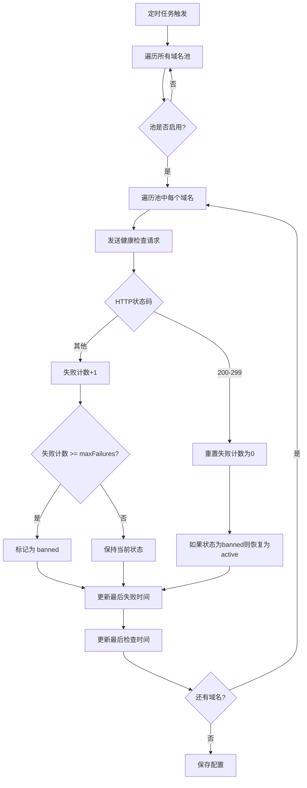

# 域名池管理功能设计方案

> **版本**: v1.0
> **设计日期**: 2026-01-18
> **状态**: 待实现

---

## 1. 需求分析

### 1.1 三道安检门

| 维度 | 分析 |
|------|------|
| **动机 (Why)** | 解决微信等平台对单一域名的封禁问题。通过域名轮换降低单一域名曝光率，实现"入口不封则流量不损失" |
| **真伪 (Truth)** | **真需求**。微信活码系统的核心痛点，单一域名容易被平台识别和封禁 |
| **定位 (Focus)** | **核心功能**。与活码系统紧密耦合，属于系统的防封基础设施 |

### 1.2 核心价值

- **防封能力**: 通过多域名轮换，降低单域名被封风险
- **高可用性**: 自动故障切换，确保服务连续性
- **可观测性**: 实时监控域名健康状态

---

## 2. 数据结构设计

### 2.1 域名实体

```typescript
interface Domain {
  id: string;
  domain: string;              // 域名，如 "mtw1.example.com"
  protocol: 'http' | 'https';  // 协议
  status: DomainStatus;
  weight: number;              // 权重（随机模式使用）
  order: number;               // 顺序（顺序模式使用）
  healthCheckUrl?: string;     // 健康检查路径
  lastCheckTime?: string;      // 最后检查时间
  lastFailureTime?: string;    // 最后失败时间
  failureCount: number;        // 连续失败次数
  totalRequests: number;       // 总请求数
  totalFailures: number;       // 总失败数
  createdAt: string;
  updatedAt: string;
}

type DomainStatus = 'active' | 'inactive' | 'banned' | 'testing';
```

### 2.2 域名池配置

```typescript
interface DomainPoolConfig {
  id: string;
  name: string;                // 池名称，如 "主域名池"
  strategy: SelectionStrategy;
  domains: Domain[];           // 域名列表
  maxFailures: number;         // 最大连续失败次数（默认3次）
  healthCheckInterval: number; // 健康检查间隔（秒，默认300）
  retryInterval: number;       // 失败重试间隔（秒，默认60）
  currentIndex: number;        // 当前轮询索引
  isActive: boolean;           // 是否启用此池
  createdAt: string;
  updatedAt: string;
}

type SelectionStrategy = 'round-robin' | 'random' | 'weighted';
```

### 2.3 域名选择结果

```typescript
interface DomainSelection {
  domain: string;
  fullUrl: string;
  poolId: string;
  domainId: string;
}
```

---

## 3. 核心流程设计

### 3.1 域名选择流程



### 3.2 健康检查流程



---

## 4. API 接口设计

### 4.1 域名池配置

```typescript
// GET /api/admin/domain-pool
interface GetDomainPoolResponse {
  success: boolean;
  data: {
    config: DomainPoolConfig;
    statistics: {
      totalDomains: number;
      activeDomains: number;
      bannedDomains: number;
      inactiveDomains: number;
      testingDomains: number;
      totalRequests: number;
      totalFailures: number;
      successRate: number;
    };
  };
}

// PUT /api/admin/domain-pool/config
interface UpdatePoolConfigRequest {
  strategy?: SelectionStrategy;
  maxFailures?: number;
  healthCheckInterval?: number;
  retryInterval?: number;
  isActive?: boolean;
}

interface UpdatePoolConfigResponse {
  success: boolean;
  data?: DomainPoolConfig;
  message?: string;
}
```

### 4.2 域名管理

```typescript
// POST /api/admin/domain-pool/domains
interface AddDomainRequest {
  domain: string;
  protocol: 'http' | 'https';
  weight?: number;
  order?: number;
  healthCheckUrl?: string;
}

interface AddDomainResponse {
  success: boolean;
  data?: Domain;
  message?: string;
}

// PUT /api/admin/domain-pool/domains/:id
interface UpdateDomainRequest {
  domain?: string;
  protocol?: 'http' | 'https';
  status?: DomainStatus;
  weight?: number;
  order?: number;
  healthCheckUrl?: string;
}

interface UpdateDomainResponse {
  success: boolean;
  data?: Domain;
  message?: string;
}

// DELETE /api/admin/domain-pool/domains/:id
interface DeleteDomainResponse {
  success: boolean;
  message?: string;
}

// POST /api/admin/domain-pool/domains/:id/toggle
// 切换域名状态 (active <-> inactive)
interface ToggleDomainResponse {
  success: boolean;
  data?: Domain;
  message?: string;
}
```

### 4.3 健康检查

```typescript
// POST /api/admin/domain-pool/health-check
// 手动触发健康检查
interface HealthCheckResponse {
  success: boolean;
  data: {
    checked: number;
    healthy: number;
    unhealthy: number;
    results: Array<{
      domainId: string;
      domain: string;
      status: 'ok' | 'failed';
      responseTime?: number;
      error?: string;
    }>;
  };
}
```

### 4.4 域名选择（供跳转使用）

```typescript
// GET /api/admin/domain-pool/select
// 获取下一个可用域名
interface SelectDomainResponse {
  success: boolean;
  data?: DomainSelection;
  message?: string;
}
```

---

## 5. 数据存储结构

### 5.1 文件路径

```
server/data/
├── live-codes.json    # 活码数据
└── domain-pool.json   # 域名池数据 (新增)
```

### 5.2 JSON 结构

```json
{
  "config": {
    "id": "pool-main",
    "name": "主域名池",
    "strategy": "round-robin",
    "maxFailures": 3,
    "healthCheckInterval": 300,
    "retryInterval": 60,
    "currentIndex": 0,
    "isActive": true,
    "createdAt": "2026-01-18T00:00:00.000Z",
    "updatedAt": "2026-01-18T00:00:00.000Z"
  },
  "domains": [
    {
      "id": "domain-1",
      "domain": "mtw1.example.com",
      "protocol": "https",
      "status": "active",
      "weight": 1,
      "order": 1,
      "healthCheckUrl": "/health",
      "lastCheckTime": "2026-01-18T12:00:00.000Z",
      "failureCount": 0,
      "totalRequests": 1234,
      "totalFailures": 5,
      "createdAt": "2026-01-18T00:00:00.000Z",
      "updatedAt": "2026-01-18T12:00:00.000Z"
    },
    {
      "id": "domain-2",
      "domain": "mtw2.example.com",
      "protocol": "https",
      "status": "active",
      "weight": 1,
      "order": 2,
      "healthCheckUrl": "/health",
      "lastCheckTime": "2026-01-18T12:00:00.000Z",
      "failureCount": 0,
      "totalRequests": 1180,
      "totalFailures": 3,
      "createdAt": "2026-01-18T00:00:00.000Z",
      "updatedAt": "2026-01-18T12:00:00.000Z"
    }
  ]
}
```

---

## 6. UI 设计

### 6.1 域名池管理页面

```
┌─────────────────────────────────────────────────────────────┐
│  LinkOS 管理后台                              [管理员头像]    │
├─────────────────────────────────────────────────────────────┤
│ 📊 仪表盘  │  📱 我的活码  │  🌐 域名池管理  │  📊 数据    │
│                                                         │
├─────────────────────────────────────────────────────────────┤
│  域名池配置                                                      │
│  ┌──────────────────────────────────────────────────────┐  │
│  │  当前策略: [顺序轮询 ▼]  池状态: [●启用/○停用]            │  │
│  │  最大失败次数: [3]  检查间隔: [300秒]                    │  │
│  │  [保存配置]  [手动健康检查]                              │  │
│  └──────────────────────────────────────────────────────┘  │
│                                                              │
│  域名列表                                    [+ 添加域名]   │
│  ┌──────────────────────────────────────────────────────┐  │
│  │ 序号 │ 域名             │ 状态    │ 权重 │ 操作       │  │
│  ├──────────────────────────────────────────────────────┤  │
│  │  1   │ mtw1.xxx.com     │ 🟢活跃  │  1   │ 编辑/删除  │  │
│  │  2   │ mtw2.xxx.com     │ 🔴封禁  │  1   │ 编辑/删除  │  │
│  │  3   │ mtw3.xxx.com     │ 🟡测试  │  2   │ 编辑/删除  │  │
│  │  4   │ mtw4.xxx.com     │ ⚪停用  │  1   │ 编辑/删除  │  │
│  └──────────────────────────────────────────────────────┘  │
│                                                              │
│  统计信息                                                      │
│  ┌──────────────────────────────────────────────────────┐  │
│  │ 总域名: 15 │ 活跃: 12 │ 封禁: 2 │ 停用: 1              │  │
│  │ 今日请求: 1,234 │ 成功率: 98.5%                         │  │
│  └──────────────────────────────────────────────────────┘  │
└─────────────────────────────────────────────────────────────┘
```

### 6.2 添加/编辑域名弹窗

```
┌──────────────────────────────────────┐
│  添加域名                  [×]       │
├──────────────────────────────────────┤
│  标记 * 必填                          │
│                                       │
│  域名 *                               │
│  ┌─────────────────────────────────┐ │
│  │ mtw.example.com                 │ │
│  └─────────────────────────────────┘ │
│                                       │
│  协议 *                               │
│  ○ HTTPS  ● HTTP                      │
│                                       │
│  权重 (随机模式)                       │
│  ┌─────────────────────────────────┐ │
│  │ 1                              │ │
│  └─────────────────────────────────┘ │
│                                       │
│  健康检查路径                          │
│  ┌─────────────────────────────────┐ │
│  │ /health                        │ │
│  └─────────────────────────────────┘ │
│                                       │
│  [取消]              [保存]           │
└──────────────────────────────────────┘
```

### 6.3 状态说明

| 状态 | 图标 | 说明 |
|------|------|------|
| active (活跃) | 🟢 | 域名正常使用中 |
| banned (封禁) | 🔴 | 连续失败超过阈值，被标记为封禁 |
| inactive (停用) | ⚪ | 手动停用，不参与轮换 |
| testing (测试) | 🟡 | 新添加或恢复，观察中 |

---

## 7. 选择策略详解

### 7.1 顺序轮询 (round-robin)

- 按照域名的 `order` 字段顺序依次选择
- 每次选择后 `currentIndex + 1`
- 到达末尾后从头开始
- 跳过非 `active` 状态的域名

### 7.2 随机选择 (random)

- 从所有 `active` 状态的域名中随机选择
- 每个域名被选中的概率相等

### 7.3 权重随机 (weighted)

- 根据 `weight` 字段计算权重
- 权重越高，被选中的概率越大
- 只从 `active` 状态的域名中选择

---

## 8. 边界情况处理

| 场景 | 处理方式 |
|------|----------|
| 域名池为空 | 返回 null，调用方使用 mainUrl 降级 |
| 所有域名被封 | 返回 null，调用方使用 mainUrl 降级 |
| 健康检查全部失败 | 保持当前状态不变，等待下次检查 |
| 并发选择域名 | 使用文件锁保证原子性 |
| 域名解析失败 | 计入失败次数，连续失败后标记为 banned |

---

## 9. 性能考虑

- 健康检查采用异步非阻塞方式
- 域名选择使用内存缓存（读取时同步，更新时异步）
- 统计数据采用计数器模式，避免每次全量计算

---

## 10. 实施计划

### Phase 1: 后端基础
- [ ] 创建域名池数据存储服务
- [ ] 实现域名池 CRUD API
- [ ] 实现三种选择策略

### Phase 2: 后端高级
- [ ] 实现健康检查定时任务
- [ ] 实现统计数据更新
- [ ] 实现降级机制

### Phase 3: 前端实现
- [ ] 创建域名池管理页面
- [ ] 实现域名列表和增删改
- [ ] 实现配置面板
- [ ] 集成到导航系统

### Phase 4: 测试验证
- [ ] 单元测试
- [ ] 集成测试
- [ ] 性能测试

---

## 11. 变更记录

| 版本 | 日期 | 变更内容 |
|------|------|---------|
| v1.0 | 2026-01-18 | 初始版本 |

---

## Sources
- [活码二维码(动态二维码)域名池介绍](https://blog.csdn.net/yinyueboke/article/details/122068281)
- [快码【活码】防封指南](https://zhuanlan.zhihu.com/p/377699663)
- [史上最全微信域名防封API原理及实现方案](https://cloud.tencent.com/developer/article/1602820)
