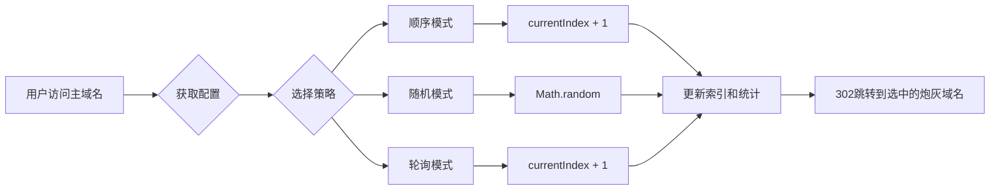

# 炮灰域名落地展示策略设计

**Document ID**: fallback-landing-strategy-v1.0
**Created**: 2026-01-18
**Status**: Approved for Implementation

---

## 1. 需求澄清

### 1.1 场景理解

这是一个**多级域名架构**，而非故障转移：

```
用户访问
    ↓
主域名（入口，稳定，永不丢失）
    ↓ 根据策略选择
炮灰域名（落地，实际承载流量）
    ↓
最终内容
```

### 1.2 角色定位

| 角色 | 作用 | 特性 |
|-----|------|------|
| **主域名** | 入口域名 | 对外发布，永不丢失，稳定可靠 |
| **炮灰域名** | 落地域名 | 实际承载流量，可灵活调整 |

### 1.3 与故障转移的区别

| 维度 | 故障转移（之前理解） | 落地展示（正确理解） |
|-----|------------------|-------------------|
| 主域名角色 | 优先使用 | 入口，永不丢失 |
| 炮灰域名角色 | 备用，主域名失败时使用 | 落地，承载实际流量 |
| 触发条件 | 主域名故障 | 每次访问都选择 |
| 选择目的 | 容错 | 负载均衡/流量分配 |

---

## 2. 三种落地展示模式

### 2.1 模式对比

| 模式 | 行为 | 适用场景 | 状态需求 |
|-----|------|---------|---------|
| **顺序模式 (sequential)** | 按1→2→3顺序循环，每次选择下一个 | 流量按顺序分配 | 需记录当前索引 |
| **随机模式 (random)** | 每次随机选择一个炮灰域名 | 负载均衡，分散压力 | 无需状态 |
| **轮询模式 (round-robin)** | 循环遍历，确保流量完全均匀分配 | 精确的负载均衡 | 需记录当前索引 |

### 2.2 选择流程



---

## 3. 数据模型设计

### 3.1 DomainConfig 接口扩展

```typescript
interface DomainConfig {
  // 主域名配置（锁定后不可修改）
  primaryDomain?: {
    domainId: string;
    domain: string;
    protocol: 'http' | 'https';
    lockedAt: string;
    locked: boolean;
  };

  // 炮灰域名配置
  fallbackDomains: {
    domainIds: string[];     // 炮灰域名ID列表（顺序决定优先级）
    priority: number[];      // 优先级

    // 落地展示策略
    selectionMode: 'sequential' | 'random' | 'round-robin';

    // 状态记录（用于顺序/轮询模式）
    currentIndex?: number;   // 当前跳转到的索引

    // 统计信息
    stats: {
      totalRedirects: number;        // 总跳转次数
      lastRedirectAt?: string;        // 最后跳转时间
      domainStats: {
        [domainId: string]: {
          redirectCount: number;       // 该域名的跳转次数
          lastRedirectAt?: string;    // 该域名最后跳转时间
        }
      }
    };

    failoverEnabled?: boolean; // 保留字段（可能未来用于真正的故障转移）
    updatedAt: string;
  };

  // 全局策略（保留但不在UI显示）
  strategy?: string;
}
```

### 3.2 初始状态

```typescript
const initialFallbackDomains = {
  domainIds: [],
  priority: [],
  selectionMode: 'sequential' as const,
  currentIndex: 0,
  stats: {
    totalRedirects: 0,
    domainStats: {}
  }
};
```

---

## 4. 选择逻辑实现

### 4.1 顺序模式 (Sequential)

```typescript
function selectSequential(
  config: FallbackDomainsConfig,
  domainCount: number
): number {
  if (domainCount === 0) return 0;
  const nextIndex = (config.currentIndex + 1) % domainCount;
  return nextIndex;
}
```

**行为**：
- 第1次访问 → 选择索引0
- 第2次访问 → 选择索引1
- 第3次访问 → 选择索引2
- 第4次访问 → 选择索引0（循环）

### 4.2 随机模式 (Random)

```typescript
function selectRandom(domainCount: number): number {
  if (domainCount === 0) return 0;
  return Math.floor(Math.random() * domainCount);
}
```

**行为**：
- 每次访问随机选择一个炮灰域名
- 不记录状态，完全随机

### 4.3 轮询模式 (Round Robin)

```typescript
function selectRoundRobin(
  config: FallbackDomainsConfig,
  domainCount: number
): number {
  if (domainCount === 0) return 0;
  const nextIndex = (config.currentIndex + 1) % domainCount;
  return nextIndex;
}
```

**行为**：
- 与顺序模式逻辑相同
- 语义不同：强调"轮"的概念，确保流量完全均匀分配

---

## 5. API 接口设计

### 5.1 更新域名配置 API

```typescript
// PUT /api/admin/live-codes/:id/domain-config
interface UpdateDomainConfigRequest {
  fallbackDomains: {
    domainIds: string[];
    priority: number[];
    selectionMode: 'sequential' | 'random' | 'round-robin';
    currentIndex?: number;
  };
}
```

### 5.2 获取跳转目标 API

```typescript
// GET /api/link/:id/resolve-domain
// 根据配置返回应该跳转到的炮灰域名
interface ResolveDomainResponse {
  primaryDomain: {
    domain: string;
    protocol: string;
  };
  fallbackDomain?: {
    domain: string;
    protocol: string;
    index: number;  // 在列表中的位置
  };
  mode: 'direct' | 'fallback-redirect';
}
```

---

## 6. UI 设计

### 6.1 域名配置面板

```
┌─────────────────────────────────────────────────┐
│ 🌐 域名配置                                      │
├─────────────────────────────────────────────────┤
│                                                 │
│ 主域名配置 [🔒 已锁定]                           │
│ ┌─────────────────────────────────────────┐   │
│ │ https://main.example.com                 │   │
│ │ 说明：主域名作为入口，永不丢失           │   │
│ └─────────────────────────────────────────┘   │
│                                                 │
│ 炮灰域名配置 (3 个)                             │
│ ┌─────────────────────────────────────────┐   │
│ │ 落地展示策略: [顺序模式 ▼]               │   │
│ │                                         │   │
│ │ 📊 统计信息                              │   │
│ │   当前跳转: 第2个 → 总计: 1,234次       │   │
│ │                                         │   │
│ │ 炮灰域名列表:                           │   │
│ │ 1. backup1.com                           │   │
│ │    使用: 412次 (33.4%)                  │   │
│ │    [↑] [↓] [🗑️]                        │   │
│ │                                         │   │
│ │ 2. backup2.com ← 当前                   │   │
│ │    使用: 411次 (33.3%)                  │   │
│ │    [↑] [↓] [🗑️]                        │   │
│ │                                         │   │
│ │ 3. backup3.com                           │   │
│ │    使用: 411次 (33.3%)                  │   │
│ │    [↑] [↓] [🗑️]                        │   │
│ │                                         │   │
│ │ [选择炮灰域名 ▼] [添加]                 │   │
│ └─────────────────────────────────────────┘   │
└─────────────────────────────────────────────────┘
```

### 6.2 策略选择下拉框

```typescript
const SELECTION_MODES = [
  {
    value: 'sequential',
    label: '顺序模式',
    description: '按1→2→3顺序循环跳转，流量按顺序分配'
  },
  {
    value: 'random',
    label: '随机模式',
    description: '随机选择一个炮灰域名跳转，负载均衡'
  },
  {
    value: 'round-robin',
    label: '轮询模式',
    description: '循环遍历，确保流量完全均匀分配'
  }
];
```

---

## 7. 统计信息显示

### 7.1 显示内容

- **总跳转次数**：`fallbackDomains.stats.totalRedirects`
- **最后跳转时间**：`fallbackDomains.stats.lastRedirectAt`
- **当前跳转位置**：第 N 个（仅顺序/轮询模式）
- **每个域名的跳转次数**：`fallbackDomains.stats.domainStats[domainId].redirectCount`
- **每个域名的跳转占比**：该域名次数 / 总次数

### 7.2 计算逻辑

```typescript
function getDomainStats(domainId: string, config: DomainConfig) {
  const stats = config.fallbackDomains.stats;
  const domainStat = stats.domainStats[domainId] || { redirectCount: 0 };

  return {
    count: domainStat.redirectCount,
    percentage: stats.totalRedirects > 0
      ? (domainStat.redirectCount / stats.totalRedirects * 100).toFixed(1)
      : '0.0'
  };
}
```

---

## 8. 实施计划

### Phase 1: 数据层扩展
- [ ] 扩展 `DomainConfig` 类型定义
- [ ] 更新存储层初始化逻辑

### Phase 2: 后端实现
- [ ] 实现三种选择模式逻辑
- [ ] 实现统计信息更新
- [ ] 更新 API 接口

### Phase 3: 前端实现
- [ ] 更新 `DomainConfigPanel.tsx`
- [ ] 添加策略选择下拉框
- [ ] 添加统计信息显示
- [ ] 添加当前索引标识

### Phase 4: 测试验证
- [ ] 测试三种模式的选择逻辑
- [ ] 测试统计信息准确性
- [ ] 测试并发访问场景

---

## 9. 风险与缓解

| 风险 | 影响 | 缓解措施 |
|-----|------|---------|
| 并发访问导致索引冲突 | 统计不准确 | 使用原子操作更新索引 |
| 状态文件损坏 | 索引丢失 | 定期备份，异常时重置为0 |
| 所有炮灰域名不可用 | 跳转失败 | 返回错误提示，记录日志 |
| 统计信息过大 | 性能问题 | 定期清理或归档历史数据 |

---

## 10. 未来增强

1. **加权随机模式**：根据域名权重进行随机选择
2. **地理位置路由**：根据用户位置选择最近的炮灰域名
3. **健康检查**：炮灰域名不可用时自动跳过
4. **A/B 测试**：支持不同流量使用不同的策略
